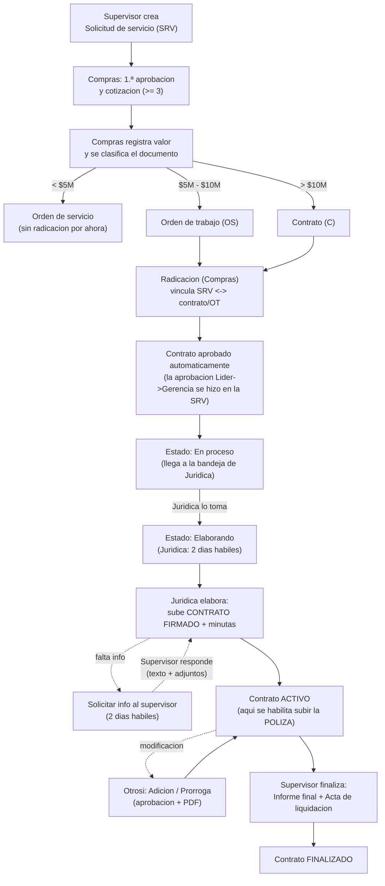
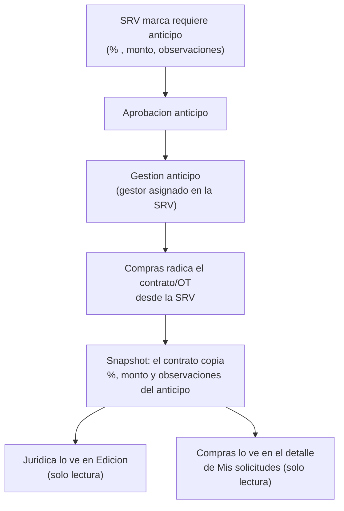

# JURICOM — Flujo de trabajo completo (Colbeef)

> Documento de referencia del equipo. Describe **todas las funciones** del sistema,
> cómo fluye el trabajo entre áreas, cómo se descargan los documentos y las **dudas
> abiertas para Jurídica** sobre trazabilidad y pagos de anticipo.
>
> Última actualización: se mantiene a mano. La fuente de verdad del comportamiento
> es el código (`backend/app`), este documento lo resume en lenguaje de negocio.

---

## 0. Diagrama general (de punta a punta)



**Anticipo (en revision):** hoy se copia (snapshot) desde la SRV al radicar. La propuesta
en discusion es que Compras lo anexe tras el borrador de Jurídica — ver seccion 6 y 9.

---

## 1. Roles y qué ve cada uno

| Rol (interno) | Nombre visible | Qué hace / módulos |
|---|---|---|
| `admin` | Administrador | Todo: usuarios, solicitudes, aprobaciones, jurídica, finalizar. |
| `compras` | Compras | Gestiona solicitudes, radica contratos/OT. |
| `juridica` | Jurídica | Elabora contratos, minutas, **trazabilidad SRV** (historial de Compras + pide info al supervisor), radica contratos (tipo C). |
| `solicitante` | **Supervisor** | Crea solicitudes; **responde info faltante** y **finaliza** los contratos que supervisa (informe + acta). |
| `anticipos` | Anticipos | Gestión de anticipos y solicitud de compra. |
| `lider_aprobador` | Líder aprobador | Aprueba solicitudes. |

---

## 2. Identificadores (códigos)

| Código | Significado |
|---|---|
| `SRV-0001` | Solicitud de **servicios** (la única que se vincula a contrato/OT). |
| `SG-0001` | Solicitud de **compra**. |
| `SA-0001` | **Salidas de almacén**. |
| `C-0001` | **Contrato** radicado (`tipo_codigo = C`). |
| `OS-0001` | **Orden de trabajo/servicio** radicada (`tipo_codigo = OS`). |

> **Importante:** "Orden de Trabajo" **no** es una entidad aparte. Es un `Contrato`
> con prefijo `OS`. Vive en la misma tabla y sigue el mismo flujo que un contrato `C`.

---

## 3. Módulo Compras — Solicitudes de gestión

Hay 3 tipos de solicitud: **Compra (SG)**, **Salidas de almacén (SA)** e **Insumos/Servicios (SRV)**.
Solo la de **servicios (SRV)** se convierte en contrato/OT.

### 3.1 Flujo de estados de una solicitud de servicios (SRV)

```
Solicitud
  → Primera aprobación
  → Cotización
  → En aprobación   (se envía cotización; requiere ≥ 3 cotizaciones)
  → Gestionando servicio   ← aquí se registra el valor y se clasifica el documento
  → (opcional) Aprobación anticipo → Gestión anticipo
  → Tramitando OC → Tramitada OC
  → Ítems en camino → Recepción de insumos
  → Entregado / Entrega parcial
  → Facturada   (cierre interno)
```

### 3.2 Clasificación documental (según el valor cotizado)

Cuando Compras **registra el valor** del servicio, el sistema clasifica el documento:

| Valor | Clasificación | Radicación hoy |
|---|---|---|
| `< $5.000.000` | **Orden de servicio** | Sin flujo de radicación por ahora. |
| `$5.000.000 – $10.000.000` | **Orden de trabajo** | Botón "Radicar orden de trabajo" → se crea como `OS`. |
| `> $10.000.000` | **Contrato** | Botón "Radicar contrato" → se crea como `C`. |

> Ambos casos (OT y contrato) usan el **mismo puente**: al radicar desde la SRV se crea
> el vínculo bidireccional y la SRV queda **actualizada** con el documento vinculado
> (`contrato_id` / `contrato_codigo`) y una entrada en su historial.

> ⚠️ No confundir la **clasificación documental** (`orden_servicio` / `orden_trabajo` /
> `contrato`, según valor) con el **prefijo del código** (`OS` / `C`). Son cosas distintas
> aunque los nombres se parezcan.

### 3.3 Anticipo dentro de la SRV

La SRV puede requerir anticipo y guarda: `requiere_anticipo`, `porcentaje_anticipo`,
`monto_anticipo`, `observaciones_anticipo`, además de su propio flujo de
**Aprobación anticipo → Gestión anticipo** con un gestor asignado.

---

## 4. Módulo Contratos — Radicación, elaboración y cierre

### 4.1 Radicación

- **Quién:** Compras/Admin (contratos y OT). Jurídica solo contratos (`C`).
- **Obligatorios al radicar:** proveedor, NIT, descripción, obligaciones, valor, plazo,
  forma de pago, centro de costos, correos de líder y gerencia, y **3 archivos**
  (Cámara de comercio, Cotización, Cédula rep. legal). El 4.º archivo es opcional.
- Si se radica **desde una SRV** (pasando `solicitud_gestion_id`), se crea el
  **vínculo bidireccional** SRV ↔ contrato/OT y se deja rastro en el historial de la SRV.

### 4.2 Trazabilidad SRV ↔ contrato/OT

```
SolicitudGestion (SRV-0001)  ⇄  Contrato/OT (OS-0003 o C-0012)
   contrato_id / contrato_codigo   ↔   solicitud_gestion_id / solicitud_gestion_codigo
```

- Es relación **1:1** (una SRV de servicios no se vincula dos veces).
- El vínculo se escribe **una sola vez, al radicar**.
- Hoy **no** hay buscador "listar contratos por su SRV"; se consulta entrando al detalle.

### 4.3 Aprobación del contrato (la hace la SRV)

```
Radicado → (aprobado automáticamente, la aprobación Líder→Gerencia se hizo en la SRV) → En proceso (bandeja de Jurídica)
```

- La aprobación Líder→Gerencia **ya ocurrió en la Solicitud de Servicio**, así que el
  contrato **nace aprobado** al radicar y pasa directo a Jurídica en estado **"En proceso"**.
  Al radicar se **notifica a Jurídica** (no al líder).
- El plazo de elaboración (**2 días hábiles** por defecto, editable) arranca cuando
  Jurídica pasa el contrato a **"Elaborando"**.
- El flujo antiguo de aprobación del contrato (Pendiente Líder → Pendiente Gerencia por
  correo) **sigue en el código pero está oculto/desactivado**; se puede reactivar si hiciera falta.

### 4.4 Estados del contrato

| Estado | Significado |
|---|---|
| `en_proceso` | Recién radicado (ya aprobado desde la SRV); en la bandeja de Jurídica. |
| `elaborando` | Jurídica lo está elaborando (plazo 2 días hábiles, arranca al entrar aquí). Se sube el **contrato firmado** y la **póliza** (solo Jurídica y Gerencia). |
| `activo` | Contrato vigente. La póliza debió cargarse en elaboración. |
| `finalizado` | Servicio cumplido y cerrado. |

### 4.5 Elaboración por Jurídica y carga de documentos

En "Edición de contrato" Jurídica puede: ajustar datos y vigencia, programar
notificaciones, generar **minutas** en Word y **solicitar información faltante** a Compras.

La carga de documentos sigue el orden del flujo:

1. **Estado `elaborando`** → Jurídica marca si **requiere póliza** (Sí/No) y sube el
   **contrato firmado**. Si marcó Sí, también aparece el cargue de **Póliza**
   (solo Jurídica y Gerencia). Para pasar a activo es obligatorio el contrato
   firmado; la póliza **no** bloquea la activación.
2. **Estado `activo`** → el contrato ya está vigente. Si la póliza quedó pendiente
   de elaboración, Jurídica/Gerencia aún puede adjuntarla.

### 4.6 Otrosí (modificaciones)

Se manejan **Adición** y **Prórroga** como bloques (pueden ir juntos como un solo
otrosí). Tienen su propia aprobación (líder → gerencia por correo) y PDF firmado.

### 4.7 Finalización

- **Quién:** el **Supervisor asignado** al contrato (o Admin).
- **Requisitos:** cargar **Informe final** + **Acta de liquidación final** (ambos
  **obligatorios**, sin importar el valor).

---

## 5. Solicitar información faltante (Jurídica ↔ Supervisor)

- Jurídica usa el módulo **Trazabilidad SRV**: ahí está la **comunicación con el supervisor** (identificada en el hilo: Jurídica vs supervisor, con usuario). Ve el historial de Compras y escribe si falta información, **con texto y fotos/archivos**.
- **No** se pide información desde Edición de contrato: esa pantalla es solo datos del contrato. Desde ahí hay un enlace a Trazabilidad SRV.
- Al **supervisor asignado** le llega **aviso por correo** y como **pendiente en el buzón**; tiene **2 días hábiles** para responder.
- El supervisor responde desde **"Finalizar contrato"** o desde el detalle de la **SRV**, con **texto + archivos adjuntos**.
- Cada mensaje (solicitud y respuesta) y cada **cambio de estado** del contrato queda también en el **historial de la SRV** vinculada.
- Al cambiar el estado (Pendiente / Elaborando / Activo), el supervisor recibe aviso por correo.

---

## 6. Anticipo en el contrato (estado actual — en revisión)

**Hoy (implementado):** al radicar **desde una SRV**, el contrato guarda una **copia
(snapshot)** del anticipo de la SRV (`requiere_anticipo`, `porcentaje_anticipo`,
`monto_anticipo`, `observaciones_anticipo`). Se muestra en la edición de Jurídica y en
el detalle de Compras.

**En discusión (pendiente de confirmar con Jurídica):** que el anticipo lo **anexe
Compras** (datos + archivo soporte) **después de que Jurídica suba el borrador**. Ver
la sección de dudas abajo.

### 6.1 Flujo del anticipo — como está hoy



> Hoy el anticipo del contrato es una **copia informativa** tomada de la SRV al radicar:
> no se edita en el contrato y no tiene archivo soporte propio ni estado de "pagado".
> Esos puntos son justo lo que se define con las dudas de la sección 9.

---

## 7. Notificaciones

- **Correo:** aprobaciones (líder/gerencia), contrato pendiente en Jurídica,
  vencimientos programados, información faltante y su respuesta.
- **Buzón (in-app):** pendientes por rol (sin póliza, listos para activar, otrosíes
  por finalizar, próximos a vencer, información solicitada, etc.).
- Hora de notificación por defecto: **07:30**.

---

## 8. Cómo descargar documentos

| Qué | Dónde en la app | Endpoint (técnico) |
|---|---|---|
| **Archivos del contrato** (cámara, cotización, cédula, póliza, borrador, informe final, acta, adjuntos de respuesta) | Detalle del contrato en **Mis solicitudes** (clic en el nombre del archivo) | `GET /api/v1/archivos/{contrato_id}/{archivo_id}` (con sesión) |
| **PDF de otrosí** | "Edición de contrato" → sección otrosíes → "Descargar PDF" | `GET /api/v1/archivos/{contrato_id}/{archivo_id}` |
| **Minuta en Word** | "Edición de contrato" → "Generar minuta" (solo Jurídica) | `GET /api/v1/contratos/{contrato_id}/minuta/{plantilla}` |
| **Plantillas de minuta disponibles** | — | `GET /api/v1/contratos/minutas/plantillas` |
| **Exportar contratos a Excel / CSV** | **Dashboard de radicaciones** (Jurídica) → botón de exportar | Se genera en el navegador (Excel/CSV). |
| **Seguimiento público de un contrato** | Enlace público por código | `GET /api/v1/contratos/seguimiento/publico?codigo=...` |

> Todas las descargas dentro de la app usan tu sesión (token). Si abres el endpoint
> directo en el navegador sin sesión, dará 401.

---

## 9. Dudas para Jurídica (trazabilidad + pagos del anticipo)

> Estas preguntas definen cómo debe quedar el **anticipo** y su rastro en el contrato.

**Sobre el momento y el responsable**
1. ¿El anticipo se anexa al contrato **solo después** de que Jurídica suba el borrador?
   ¿Qué pasa si el proveedor exige el anticipo **antes** de que exista borrador?
2. ¿Quién es responsable de **anexar** el anticipo: Compras, Tesorería o Jurídica?
3. ¿Quién marca el anticipo como **"pagado"** y en qué momento? ¿Ese pago **desbloquea**
   algún estado del contrato (p. ej. pasar a activo)?

**Sobre el dato vs. el que ya venía de la SRV**
4. El anticipo que se gestiona en la **SRV** (aprobación/gestión de anticipo) y el
   anticipo del **contrato**, ¿son el **mismo dinero** o son cosas distintas?
5. ¿El **porcentaje/monto** puede **cambiar** entre la SRV y el contrato final? Si cambia,
   ¿quién lo autoriza y cómo debe quedar registrado?
6. ¿El anticipo del contrato requiere **aprobación aparte** (líder/gerencia) o basta con
   la que ya se dio en la SRV?

**Sobre el soporte documental**
7. Cuando Compras "anexa el anticipo", ¿qué **documento** es exactamente (orden de pago,
   comprobante, acuerdo de anticipo)? ¿Lo emite Compras, Tesorería o Jurídica?
8. ¿Debe exigirse **póliza de buen manejo del anticipo** antes de habilitar el pago?
   ¿Se relaciona con la póliza normal del contrato?

**Sobre el impacto y la trazabilidad**
9. ¿El anticipo se **descuenta** del valor total y afecta los desembolsos siguientes?
   ¿Se debe reflejar en la "forma de pago"?
10. ¿Necesitan ver en el contrato el **historial del anticipo** (solicitado → aprobado →
    pagado → legalizado) o basta con el dato final?
11. Para contratos que **no** nacen de una SRV (radicación manual), ¿puede haber anticipo?
    ¿quién lo carga?
12. ¿La regla de aprobación gerencial "> $10M lo aprueba otra persona" debe **blindarse**
    en el sistema (que solo pueda aprobar quien corresponde) o basta con el correo actual?
```
