# 1. Solicitud de Compra (SG)

Colores: azul Supervisor, amarillo Líder, verde Compras, rojo cancelación, gris punteado
"vuelve a un paso anterior".

En cualquier etapa abierta, el gestor asignado (o un Admin) puede **cambiar el gestor** a otro
usuario de Compras; queda en la trazabilidad y se avisa al nuevo gestor.

```mermaid
flowchart TD
    A([Supervisor crea la solicitud de compra<br/>productos, cantidad, unidad, centro de costo,<br/>prioridad, líder y si es presupuestado]) --> B{"¿La marcó como<br/>menor cuantía?"}

    B -->|"No"| C["Estado: Solicitud<br/>Le llega un correo al líder<br/>El supervisor aún puede editarla"]
    B -->|"Sí"| CD["Compra directa:<br/>no pasa por el líder"]

    C --> D{"Primera aprobación:<br/>¿qué decide el líder?"}
    D -->|"Devuelve con ajustes"| R1["El supervisor corrige y reenvía<br/>puede cambiar de líder<br/>↩ vuelve a Estado: Solicitud"]
    D -->|"Rechaza"| X1([Cancelada])
    D -->|"Aprueba parcial"| D2["Solo siguen los ítems aprobados<br/>o con cantidades ajustadas"]
    D -->|"Aprueba todo"| P
    D2 --> P
    CD --> P

    P["Estado: Primera aprobación<br/>Aparece en el panel de Compras: Sin gestor"] --> F["Compras da clic en Gestionar<br/>Estado: En gestión<br/>queda como gestor y revisa la solicitud"]
    F --> F1{"¿Qué decide Compras?"}
    F1 -->|"Anular con motivo<br/>(también en Cotización)"| X3([Cancelada por Compras<br/>correo al supervisor y al líder])
    F1 -->|"Menor cuantía:<br/>devolver al líder"| R2["Compras la manda a aprobación del líder<br/>↩ vuelve a Estado: Solicitud"]
    F1 -->|"Menor cuantía:<br/>directo a OC"| K
    F1 -->|"Pasar a cotización"| G["Estado: Cotización<br/>Compras adjunta las cotizaciones con valores"]

    G --> G1{"¿Tiene 3 cotizaciones?"}
    G1 -->|"No"| G2["Compras escribe una justificación"]
    G1 -->|"Sí"| G3
    G2 --> G3["Compras elige quién da la 2.ª aprobación:<br/>líder de la 1.ª, Gerencia Financiera<br/>o Gerencia General"]

    G3 --> H{"Segunda aprobación:<br/>¿qué decide?"}
    H -->|"Pide recotizar"| R3["Explica el motivo<br/>↩ vuelve a Estado: Cotización"]
    H -->|"Rechaza"| X2([Cancelada])
    H -->|"Aprueba"| K

    K["Estado: Tramitando OC<br/>Compras registra la orden de compra<br/>número y valor, general o por ítem"] --> K2{"¿Requiere anticipo?"}
    K2 -->|"Sí"| K3{"¿El líder aprueba<br/>el anticipo?"}
    K3 -->|"Sí"| K4["Gestión del anticipo"]
    K3 -->|"No: sigue sin anticipo"| L
    K4 --> L
    K2 -->|"No"| L["Estado: Ítems en camino"]

    L --> M["Compras registra lo que llega<br/>puede llegar por partes"]
    M --> M1["Estado: Recepción de insumos<br/>Opcional: avisa al supervisor<br/>que puede pasar a reclamar"]
    M1 --> M2{"¿Se entrega todo?"}
    M2 -->|"Sí"| N
    M2 -->|"Solo una parte"| M3["Entrega parcial realizada"]
    M3 --> M4{"¿Llegará el resto?"}
    M4 -->|"Sí"| R4["Se espera el resto<br/>↩ vuelve a Recepción de insumos"]
    M4 -->|"No"| M5["Cerrar con pendientes<br/>queda registrado lo que faltó"]
    M5 --> N

    N["Estado: Entregado<br/>Correo al supervisor"] --> Q1["Compras adjunta la factura"]
    Q1 --> Q([Estado: Facturada<br/>se pueden sumar facturas adicionales])

    classDef sup fill:#dbeafe,stroke:#1d4ed8,color:#0f172a
    classDef lid fill:#fef9c3,stroke:#ca8a04,color:#0f172a
    classDef com fill:#dcfce7,stroke:#16a34a,color:#0f172a
    classDef fin fill:#fee2e2,stroke:#dc2626,color:#0f172a
    classDef volver fill:#f1f5f9,stroke:#64748b,stroke-dasharray:5 5,color:#334155
    class A,B sup
    class C,D,D2,H,K3 lid
    class CD,P,F,F1,G,G1,G2,G3,K,K2,K4,L,M,M1,M2,M3,M4,M5,N,Q1,Q com
    class X1,X2,X3 fin
    class R1,R2,R3,R4 volver
```

