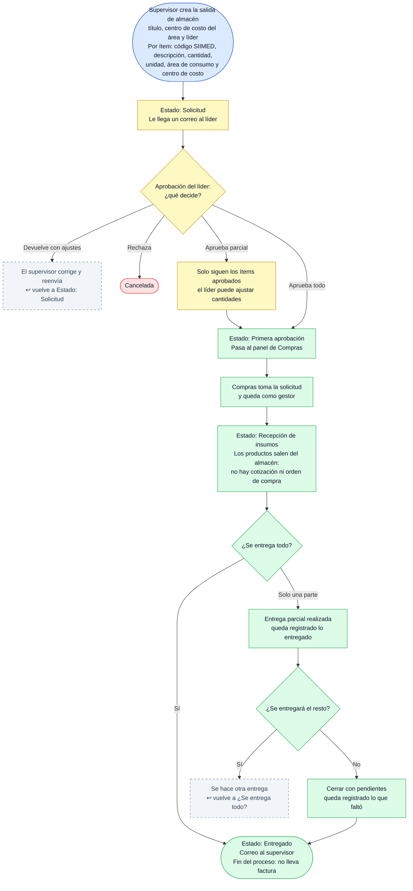

# 2. Salidas de Almacén (SA)

No hay cotización, segunda aprobación ni orden de compra: lo pedido ya está en el almacén.
Termina en **Entregado** y no lleva factura.

```mermaid
flowchart TD
    A([Supervisor crea la salida de almacén<br/>título, centro de costo del área y líder<br/>Por ítem: código SIIMED, descripción, cantidad,<br/>unidad, área de consumo y centro de costo]) --> C["Estado: Solicitud<br/>Le llega un correo al líder"]

    C --> D{"Aprobación del líder:<br/>¿qué decide?"}
    D -->|"Devuelve con ajustes"| R1["El supervisor corrige y reenvía<br/>↩ vuelve a Estado: Solicitud"]
    D -->|"Rechaza"| X1([Cancelada])
    D -->|"Aprueba parcial"| D2["Solo siguen los ítems aprobados<br/>el líder puede ajustar cantidades"]
    D -->|"Aprueba todo"| F
    D2 --> F

    F["Estado: Primera aprobación<br/>Pasa al panel de Compras"] --> G["Compras toma la solicitud<br/>y queda como gestor"]
    G --> H["Estado: Recepción de insumos<br/>Los productos salen del almacén:<br/>no hay cotización ni orden de compra"]

    H --> M2{"¿Se entrega todo?"}
    M2 -->|"Sí"| N
    M2 -->|"Solo una parte"| M3["Entrega parcial realizada<br/>queda registrado lo entregado"]
    M3 --> M4{"¿Se entregará el resto?"}
    M4 -->|"Sí"| R2["Se hace otra entrega<br/>↩ vuelve a ¿Se entrega todo?"]
    M4 -->|"No"| M5["Cerrar con pendientes<br/>queda registrado lo que faltó"]
    M5 --> N

    N([Estado: Entregado<br/>Correo al supervisor<br/>Fin del proceso: no lleva factura])

    classDef sup fill:#dbeafe,stroke:#1d4ed8,color:#0f172a
    classDef lid fill:#fef9c3,stroke:#ca8a04,color:#0f172a
    classDef com fill:#dcfce7,stroke:#16a34a,color:#0f172a
    classDef fin fill:#fee2e2,stroke:#dc2626,color:#0f172a
    classDef volver fill:#f1f5f9,stroke:#64748b,stroke-dasharray:5 5,color:#334155
    class A sup
    class C,D,D2 lid
    class F,G,H,M2,M3,M4,M5,N com
    class X1 fin
    class R1,R2 volver
```
