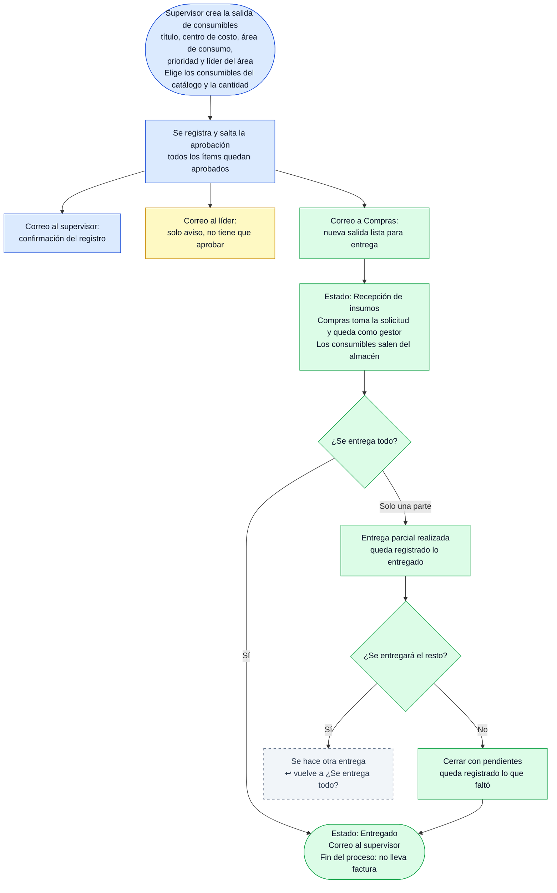

# 3. Salida de Consumibles (SC)

No pasa por aprobación: el líder solo recibe un aviso y la solicitud llega a Compras lista
para entregar. Termina en **Entregado** y no lleva factura.

```mermaid
flowchart TD
    A([Supervisor crea la salida de consumibles<br/>título, centro de costo, área de consumo,<br/>prioridad y líder del área<br/>Elige los consumibles del catálogo y la cantidad]) --> B["Se registra y salta la aprobación<br/>todos los ítems quedan aprobados"]

    B --> C1["Correo al supervisor:<br/>confirmación del registro"]
    B --> C2["Correo al líder:<br/>solo aviso, no tiene que aprobar"]
    B --> C3["Correo a Compras:<br/>nueva salida lista para entrega"]

    C3 --> H["Estado: Recepción de insumos<br/>Compras toma la solicitud y queda como gestor<br/>Los consumibles salen del almacén"]

    H --> M2{"¿Se entrega todo?"}
    M2 -->|"Sí"| N
    M2 -->|"Solo una parte"| M3["Entrega parcial realizada<br/>queda registrado lo entregado"]
    M3 --> M4{"¿Se entregará el resto?"}
    M4 -->|"Sí"| R1["Se hace otra entrega<br/>↩ vuelve a ¿Se entrega todo?"]
    M4 -->|"No"| M5["Cerrar con pendientes<br/>queda registrado lo que faltó"]
    M5 --> N

    N([Estado: Entregado<br/>Correo al supervisor<br/>Fin del proceso: no lleva factura])

    classDef sup fill:#dbeafe,stroke:#1d4ed8,color:#0f172a
    classDef lid fill:#fef9c3,stroke:#ca8a04,color:#0f172a
    classDef com fill:#dcfce7,stroke:#16a34a,color:#0f172a
    classDef volver fill:#f1f5f9,stroke:#64748b,stroke-dasharray:5 5,color:#334155
    class A,B,C1 sup
    class C2 lid
    class C3,H,M2,M3,M4,M5,N com
    class R1 volver
```
