# 4. Solicitud de Servicios (SRV) con Contrato u OS

Colores: azul Supervisor, amarillo Líder, verde Compras, morado Proyectos, rojo Jurídica /
cancelación, naranja Contabilidad y Tesorería.

En cualquier etapa abierta del panel, el gestor asignado (o un Admin) puede **cambiar el gestor**
a otro usuario de Compras.

```mermaid
flowchart TD
    subgraph S1["1. Solicitud y primera aprobación"]
        A([Supervisor crea la SRV<br/>indica si requiere visita y comité técnico]) --> B["Estado: Solicitud<br/>Correo al líder"]
        B --> C{"Líder revisa"}
        C -->|"Devuelve"| R["En revisión<br/>Supervisor corrige y puede cambiar de líder"]
        R --> B
    end

    C -->|"Rechaza"| X([Cancelado])
    C -->|"Aprueba"| D{"¿Requiere comité técnico?"}

    subgraph S2["2. Comité técnico"]
        P1["Proyectos revisa y<br/>puede reescribir la solicitud"] --> P2{"¿Requiere visita?"}
        P2 -->|"Sí"| P3["Proyectos programa la visita"] --> P4
        P2 -->|"No"| P4["Proyectos cotiza"]
        P4 --> P5["Compras complementa las cotizaciones"]
        P5 --> P6{"Mesa técnica:<br/>supervisor y Proyectos<br/>(mantenimiento consulta)"}
        P6 -->|"Sin acuerdo: recotizar"| P4
    end

    subgraph S3["2. Sin comité técnico"]
        N0["Compras da clic en Gestionar<br/>Estado: En gestión<br/>queda como gestor y revisa"] --> N0D{"¿Qué decide Compras?"}
        N0D -->|"Pasar a cotización"| N1{"¿Requiere visita?"}
        N1 -->|"Sí"| N2["Compras programa la visita"] --> N3
        N1 -->|"No"| N3["Compras cotiza: 3 cotizaciones o justificación<br/>y elige quién da la 2.ª aprobación"]
    end

    N0D -->|"Anular con motivo<br/>(también en visita o Cotización)"| X2([Cancelado por Compras<br/>correo al supervisor y al líder])

    D -->|"Sí"| P1
    D -->|"No"| N0
    P6 -->|"Ambos de acuerdo"| E
    N3 --> E

    E{"Segunda aprobación:<br/>elige la cotización ganadora"}
    E -->|"Rechaza"| X
    E -->|"Aprueba"| F

    subgraph S4["3. Gestión del servicio (Compras)"]
        F["Estado: Gestionando servicio"] --> G{"¿Requiere anticipo?"}
        G -->|"Sí"| G1["Compras solicita el anticipo:<br/>valor, porcentaje y líder"]
        G1 --> G2{"Líder aprueba el anticipo"}
        G2 -->|"Rechaza"| F
        G2 -->|"Aprueba"| G3["Gestión del anticipo"]
        G3 --> H
        G -->|"No"| H{"¿Requiere contrato u OS?"}
    end

    subgraph S5["4. Contrato u Orden de Servicio (Jurídica)"]
        J1["Compras radica el Contrato C u OS<br/>y lo vincula a la SRV.<br/>Datos: proveedor, NIT, objeto, valor, plazo,<br/>forma de pago, centro de costos, supervisor, ¿póliza?"]
        J1 --> J2["Adjuntos: cámara de comercio, cédula del<br/>representante legal y cotización ganadora de la SRV.<br/>Nace aprobado y copia el anticipo de la SRV"]
        J2 --> J3["Jurídica recibe: En proceso"]
        J3 --> J4{"¿Falta información?"}
        J4 -->|"Sí"| J5["Jurídica solicita información<br/>con plazo en días hábiles"]
        J5 --> J6["Compras o supervisor responde"]
        J6 --> J3
        J4 -->|"No"| J7["Elaborando contrato: 2 días hábiles<br/>Minuta automática: obra, orden de trabajo,<br/>suministro o CPS"]
        J7 --> J8{"¿Requiere póliza?"}
        J8 -->|"Sí"| J9["Revisión de pólizas:<br/>Jurídica adjunta la póliza"]
        J9 --> J10
        J8 -->|"No"| J10["Solicitud de firmas:<br/>Jurídica adjunta el contrato firmado"]
        J10 --> J11{"¿Tiene anticipo?"}
        J11 -->|"Sí"| J12["Contabilidad gestiona el anticipo"]
        J12 --> J13["Tesorería paga y confirma:<br/>Anticipo pagado"]
        J13 --> J14
        J11 -->|"No"| J14["Jurídica activa el contrato:<br/>Contrato activo<br/>Aviso 30 días antes del vencimiento"]
        J14 --> O1{"¿Se necesita un otrosí?<br/>prórroga o adición"}
        O1 -->|"Sí"| O2["Compras solicita, Líder y Gerencia aprueban,<br/>Jurídica carga el otrosí firmado"]
        O2 --> J14
    end

    H -->|"Sí"| J1
    H -->|"No"| K
    O1 -->|"No"| K

    K["Proveedor ejecuta el servicio"]

    subgraph S6["5. Cierre del servicio (SRV)"]
        L["Compras pide evidencia de cierre"] --> M["Supervisor sube la evidencia"]
        M --> N["Compras cierra el servicio: Entregado"]
        N --> Q([Compras registra la factura: Facturada])
    end

    subgraph S7["5. Cierre del contrato u OS (si existe)"]
        T1["Supervisor entrega el informe final"] --> T2{"¿Valor mayor a $15.000.000?"}
        T2 -->|"Sí"| T3["Jurídica carga el acta de liquidación"]
        T3 --> T4
        T2 -->|"No"| T4["Cierre en Contabilidad: pago final"]
        T4 --> T5["Cierre en Tesorería: paga con evidencia"]
        T5 --> T6([Contrato completado])
    end

    K --> L
    K -->|"Si hay contrato u OS"| T1

    classDef sup fill:#dbeafe,stroke:#1d4ed8,color:#0f172a
    classDef lid fill:#fef9c3,stroke:#ca8a04,color:#0f172a
    classDef com fill:#dcfce7,stroke:#16a34a,color:#0f172a
    classDef pro fill:#ede9fe,stroke:#7c3aed,color:#0f172a
    classDef jur fill:#fee2e2,stroke:#dc2626,color:#0f172a
    classDef fin fill:#ffedd5,stroke:#ea580c,color:#0f172a
    class A,R,M,T1 sup
    class B,C,E,G2 lid
    class N0,N0D,N1,N2,N3,F,G,G1,G3,H,K,L,N,Q,P5,J1,J2,J6 com
    class D,P1,P2,P3,P4,P6 pro
    class J3,J4,J5,J7,J8,J9,J10,J11,J14,O1,O2,T3,X,X2 jur
    class J12,J13,T4,T5,T6 fin
```

