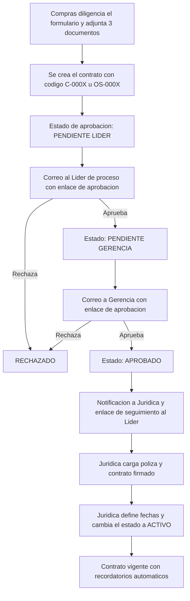

# Proceso de Radicación de Contratos y Órdenes de Trabajo

**Sistema:** JURICOM_BEEF — Gestión Jurídica de Colbeef
**Ámbito:** Ciclo de vida de una solicitud de contrato, desde su radicación por Compras hasta su activación por Jurídica.
**Última actualización:** documento vivo, alinear con el código fuente ante cualquier cambio.

---

## 1. Objetivo

Este documento describe el proceso de **radicación** de un **Contrato** o una
**Orden de Trabajo**, los roles involucrados, los estados que atraviesa la
solicitud y las reglas de negocio que gobiernan cada etapa. Sirve como
referencia funcional para los equipos de Compras, Jurídica y Gerencia, y como
guía de mantenimiento para el equipo técnico.

---

## 2. Definiciones

| Término | Definición |
|---------|------------|
| **Radicación** | Acto de crear y registrar formalmente una solicitud de contrato en el sistema. Es responsabilidad del área de Compras. |
| **Contrato** | Documento formal identificado con el prefijo `C-` (por ejemplo, `C-0001`). |
| **Orden de Trabajo** | Solicitud de servicio identificada con el prefijo `OS-` (por ejemplo, `OS-0001`). |
| **Otrosí** | Modificación posterior a un contrato vigente (prórroga, adición o modificación). |

Ambos tipos comparten el mismo flujo operativo; se diferencian únicamente en su
nomenclatura y en que **la numeración es consecutiva e independiente por tipo**.

---

## 3. Roles y responsabilidades

| Rol | Responsabilidad en el proceso |
|-----|-------------------------------|
| **Compras** | Radica la solicitud, diligencia la información del negocio y adjunta la documentación obligatoria. |
| **Líder de proceso** | Otorga la primera aprobación mediante enlace seguro enviado por correo electrónico. |
| **Gerencia** | Otorga la segunda aprobación, también mediante enlace seguro por correo electrónico. |
| **Jurídica** | Formaliza el contrato aprobado: carga póliza y documento firmado, define fechas y activa la solicitud. |
| **Admin** | Dispone de los permisos de todos los roles anteriores. |

Principio rector: **Compras propone, Líder y Gerencia aprueban, Jurídica formaliza.**

---

## 4. Diagrama del flujo

---

## 5. Descripción de las etapas

### 5.1 Radicación (Compras)

Compras accede a **"Radicar solicitud"**, selecciona el tipo (**Contrato** u
**Orden de Trabajo**) y diligencia la información requerida:

- Proveedor / contratista y NIT.
- Descripción del servicio.
- Obligaciones de Colbeef y del proveedor.
- Valor y moneda.
- Plazo (días, meses o años).
- Condiciones de recibido satisfactorio.
- Indicación de si requiere póliza.
- Correo del **líder de proceso** y correo de **gerencia**.

Documentación obligatoria adjunta (ver sección 7).

> **Nota:** Compras no define las fechas de inicio, fin ni notificación. Esa
> responsabilidad corresponde a Jurídica en la etapa de formalización.

Al registrar la solicitud, el sistema:

1. Genera un **código único** (`C-000X` u `OS-000X`).
2. Establece el estado de aprobación en **PENDIENTE LÍDER**.
3. Envía un **correo al líder de proceso** con un enlace seguro para aprobar o rechazar.

### 5.2 Aprobación del líder de proceso

El líder recibe el correo, revisa la solicitud a través del enlace y decide:

- **Aprueba:** el estado avanza a **PENDIENTE GERENCIA** y se notifica a Gerencia.
- **Rechaza:** el estado pasa a **RECHAZADO** y el flujo se detiene.

### 5.3 Aprobación de Gerencia

Gerencia revisa mediante su enlace y decide:

- **Aprueba:** el estado avanza a **APROBADO**; se notifica a Jurídica y se envía
  un **enlace de seguimiento** al líder de proceso.
- **Rechaza:** el estado pasa a **RECHAZADO**.

### 5.4 Formalización (Jurídica)

Únicamente cuando el estado es **APROBADO**, Jurídica puede visualizar y editar
la solicitud. En esta etapa Jurídica:

1. Carga la **póliza** (si el contrato la requiere) y el **contrato firmado**.
2. Define **fecha de inicio**, **fecha de fin**, **fecha y hora de notificación**.
3. Cambia el estado del contrato a **ACTIVO**.

> Si Jurídica activa el contrato sin definir fechas, el sistema las calcula
> automáticamente: inicio = fecha actual; fin = inicio + plazo; notificación =
> 30 días antes de la fecha de fin.

### 5.5 Contrato vigente

Una vez activo, el contrato:

- Admite **otrosíes** (prórroga, adición, modificación).
- Genera **recordatorios automáticos** de vencimiento.

---

## 6. Estados del proceso

El sistema gestiona dos dimensiones de estado, complementarias entre sí.

### 6.1 Estado de aprobación (flujo de autorizaciones)

| Estado | Significado |
|--------|-------------|
| `PENDIENTE_LIDER` | En espera de aprobación del líder de proceso. |
| `PENDIENTE_GERENCIA` | En espera de aprobación de Gerencia. |
| `APROBADO` | Autorizado; disponible para Jurídica. |
| `RECHAZADO` | Rechazado por el líder o por Gerencia. |

### 6.2 Estado del contrato (ciclo de vida)

| Estado | Significado |
|--------|-------------|
| `EN_PROCESO` | Creado, pendiente de activación. |
| `ACTIVO` | Vigente. |
| `FINALIZADO` | Concluido. |

**Regla de control:** Jurídica solo accede a la edición del contrato cuando el
estado de aprobación es `APROBADO`.

---

## 7. Documentación requerida

**Adjuntada por Compras al radicar (obligatoria):**

1. Cámara de comercio.
2. Cotización.
3. Cédula del representante legal.

Se admite, opcionalmente, un archivo adicional.

**Cargada por Jurídica durante la formalización:**

- Póliza (cuando aplique).
- Contrato firmado.
- Otrosí firmado (cuando existan otrosíes).

Las aprobaciones del líder y de Gerencia se realizan mediante enlaces seguros
enviados por correo electrónico; no se requiere carga de soportes gráficos.

---

## 8. Notificaciones automáticas

- Al alcanzarse la **fecha de notificación** definida por Jurídica, el sistema
  envía un recordatorio de vencimiento a las listas de **Jurídica y Compras**.
- Un proceso en segundo plano evalúa esta condición periódicamente.
- El recordatorio no se duplica: se reenvía únicamente si Jurídica actualiza la
  fecha de notificación.

---

## 9. Validaciones de negocio

Al radicar, el sistema aplica las siguientes validaciones:

- Solo los roles **Compras** y **Admin** pueden radicar.
- Todos los campos de texto son obligatorios, incluidos ambos correos.
- El **valor** debe ser mayor que 0 y dentro del máximo admitido.
- El **plazo** debe ser mayor que 0.
- Deben adjuntarse los **tres documentos obligatorios**.

---

## 10. Referencias técnicas

| Componente | Ubicación |
|------------|-----------|
| Reglas de radicación | `backend/app/application/use_cases/contratos/radicar_solicitud.py` |
| Endpoints de contrato (crear, aprobar, activar) | `backend/app/presentation/api/v1/endpoints/contratos.py` |
| Entidad de negocio | `backend/app/domain/entities/contrato.py` |
| Estados de aprobación | `backend/app/domain/value_objects/estado_aprobacion.py` |
| Formulario de radicación | `frontend/public/compras/solicitud-radicar.html` |
| Recordatorios automáticos | `backend/app/application/services/contrato_vencimiento_notificaciones.py` |

---

## 11. Preguntas frecuentes

**¿Puede Compras definir las fechas del contrato?**
No. Compras describe el negocio; las fechas las define Jurídica al formalizar y activar.

**¿Por qué Jurídica no visualiza un contrato recién radicado?**
Porque aún no cuenta con las aprobaciones del líder y de Gerencia. Solo es
visible para Jurídica cuando el estado es `APROBADO`.

**¿Qué diferencia hay entre Contrato y Orden de Trabajo?**
El flujo es idéntico; se diferencian en la nomenclatura (`C-` frente a `OS-`) y
en que cada tipo lleva su propia numeración consecutiva.

**¿Qué ocurre si el líder o Gerencia rechaza la solicitud?**
El contrato pasa a estado `RECHAZADO` y el flujo se detiene.

**¿Son seguros los enlaces de aprobación?**
Sí. Cada enlace incorpora un token firmado, único por contrato y por etapa
(líder o gerencia), lo que impide aprobaciones no autorizadas.
